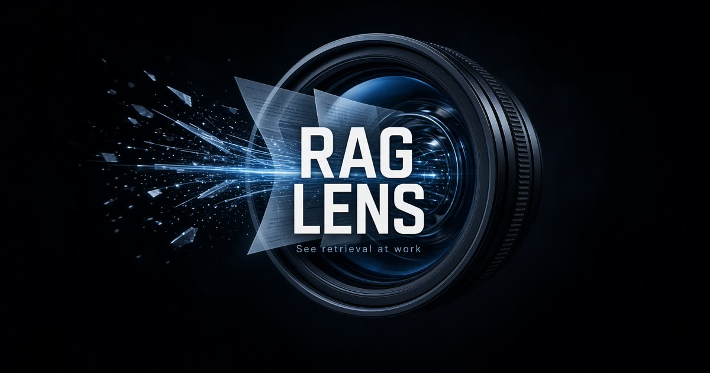

# RAG Lens

互動式 **RAG 管線除錯器**：貼文件、調切塊與 Top-K，立刻看檢索怎麼變，並把回答對回原文。

**Live demo:** [https://fern-lark-clover-forest.grok.me](https://fern-lark-clover-forest.grok.me)

[](https://fern-lark-clover-forest.grok.me)



這是教學／除錯工具，不是生產級 RAG。相似度、token 數、embedding 草圖與依據標記都標成**估算**。

## 它做什麼

RAG 常被做成聊天框。Lens 把管線攤開：

**Document → Chunking → Embedding → Search → Top-K → Context → LLM → Answer**

每個節點可點。改 chunk size、overlap、Top-K、TF-IDF / BM25、Greedy / MMR，檢索結果立刻重算。

內建虛構樣本《光摺光學》內部簡報，問題是 Helix-9 的波長與鹽霧失效模式。沒有 RAG 時模型通常答不出 940 nm 與 82°C 層間剝離。

## 功能

- **切塊可視化** — 字元視窗 + 句界微調，時間軸與原文覆蓋顯示 overlap
- **排序器** — TF-IDF 餘弦 vs BM25（估算，非神經 embedding）
- **MMR** — 相對 Greedy Top-K 去重，避免 overlap 連取相鄰段
- **失敗實驗** — 切碎關鍵句、只取 1 塊、加入干擾段
- **檢索診斷** — 金標事實命中 / K 外 / 切碎、干擾段是否擠進 Top-K
- **有／無 RAG 對照** — 同一問題，grok-4.5 看上下文 vs 只看問題
- **來源定位** — 點回答裡的 `#1` 或「有依據」，看到切塊、原文字元範圍、支持該句的文字
- **依據標記** — 只統計有事實的句子；開場語與單獨引用不計。高詞彙重疊若極性相反（「940 nm」vs「不是 940 nm」）會標出來
- **實驗對照** — 記住一組設定，改參數後比較命中、上下文長度、Top-K 與回答
- **生成狀態** — 生成中 / 失敗可重試 / 參數已改則舊回答標過期

無需登入。文件與參數存在瀏覽器 `localStorage`。

## 管線怎麼算（估算）

| 階段 | 實際做法 |
| --- | --- |
| Chunking | 字元滑動視窗，盡量在句號處切開 |
| Embedding | 詞項 TF-IDF；32 維雜湊草圖只給 2D 散點圖 |
| Search | TF-IDF 餘弦或 Okapi BM25 |
| Top-K | Greedy，或 MMR（λ 0.72） |
| LLM | 你按按鈕才呼叫 grok-4.5，`max_tokens` 360 |

沒有雲端向量資料庫，也沒有 dense embedding API。滑桿才能即時重跑。

## 建議怎麼玩

1. 開 [線上展示](https://fern-lark-clover-forest.grok.me)，預設問題已填好。
2. 按 **Search**，應看到 `2/2 命中`。
3. **生成回答**，點 `#1` 看來源定位。
4. **存成對照**，再按 **只取 1 塊** 或 **切碎關鍵句**，對照表會寫出差了什麼。
5. **加入干擾段**，看錯誤更正段會不會擠進 Top-K。
6. **對照無 RAG**，同一問題在沒有這份文件時通常會承認不知道。

## 技術棧

- React 19 + TanStack Start / Router
- Vite + Tailwind CSS v4
- Zustand（persist）
- 檢索在瀏覽器端；生成走伺服器函式呼叫 xAI

## 本機執行

```bash
npm install
npm run dev
```

開發伺服器預設聽 `0.0.0.0:8080`。

生成回答需要環境變數 `XAI_API_KEY`（只在伺服器端讀取）。沒有金鑰時，切塊與檢索仍可完整操作，生成會顯示無法呼叫模型。

```bash
npm run typecheck
npm run build
```

## 授權與資料

示範文件為虛構公司與產品，僅供 RAG 教學。請勿把真實個資貼進公開部署的實例。

私人倉庫：[richie7p/rag-lens](https://github.com/richie7p/rag-lens)  
線上展示：<https://fern-lark-clover-forest.grok.me>
